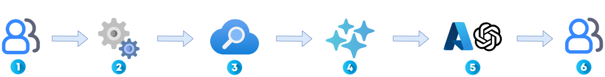
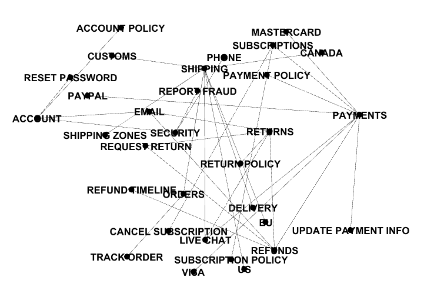
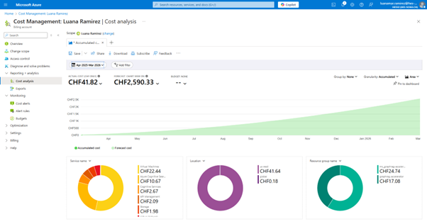

# Azure-Samples graphrag-accelerator

## 1. Introduction

### Background and objectives

GraphRAG Accelerator is an open-source project from Azure-Samples that illustrates how information retrieval and text generation can be combined to create advanced artificial intelligence applications. By integrating Azure Cognitive Search for indexing and searching large datasets, and Azure OpenAI for generating answers from powerful language models, GraphRAG Accelerator enables the implementation of a “retrieval-augmented generation” (RAG) approach. The main aim of this project is to provide a ready-to-use solution that reduces development time and offers a concrete example for experimenting with and deploying intelligent applications capable of providing contextualized responses.

### Target audience

This documentation is aimed primarily at developers, cloud architects, artificial intelligence researchers and IT professionals who want to explore the capabilities of Azure services in the field of AI. It is also aimed at students and technology enthusiasts who want to learn how to combine search tools and language models to create innovative solutions.

## 2. Architecture and Components

### Architecture overview

GraphRAG Accelerator combines two services: information retrieval and text generation.


1. Prompt reception: The user or application sends a request or prompt.
2. Pre-processing module: Before being sent to the search engine, the pre-processing module analyzes and prepares the prompt. It performs operations such as text cleaning, normalization and extraction of relevant keywords. This optimizes the query, improving the quality of the data sent afterwards.
3. Azure Cognitive Search: The search module queries Azure Cognitive Search crawls the index to find relevant documents or extracts that match the context of the query.
4. Prompt enrichment: The search results are retrieved and merged with the original prompt to create an enriched query. This provides the text generation model with additional context, improving the quality of the generated response.
5. Azure OpenAI: The enriched query is forwarded to Azure OpenAI (or an equivalent text generation service), which generates a context-sensitive, tailored response.
6. Return Response: The generated response is returned to the user or integrated into the application.

### Component Description

#### Azure Cognitive Search

This service indexes, searches and analyzes large quantities of textual data. In the context of GraphRAG Accelerator, it is used to extract relevant information from databases or documents, making it easier to retrieve the knowledge needed to enrich prompts.

#### Azure OpenAI (or text generation service)

Azure OpenAI provides access to advanced language models (such as GPT-4). Once the prompt has been enriched with search results, the language model generates answers or content based on the context provided. This produces more relevant and nuanced responses.

#### Deployment scripts

Scripts such as deploy.sh and associated parameter files (e.g. deploy.parameters.json) automate the deployment of the entire architecture on Azure. They configure the necessary resources (resource groups, virtual machines, cognitive services, etc.) and ensure that the various components interact correctly.

## 3. Prerequisites

### Azure environment

To deploy GraphRAG Accelerator, a pay-to-go subscription is required. The student subscription does not provide sufficient quotas (especially for vCPUs) to deploy all the resources required by the project.

Increase the vCPU quota for the Standard ESv5 and Standard DSv5 families to 12-16 vCPUs. Log in to your subscription, go to “Usage + quotas” and try to add the desired quota. As this operation usually fails, you will need to submit an upgrade request via Azure support.

### Tools required

To deploy GraphRAG Accelerator, you need the following tools:

* Azure CLI (&gt;= v2.55.0): to interact with Azure services via the command line.
* Bash: to run deployment scripts.
* Standard Linux utilities: such as awk, cut, sed and curl for data processing and file transfer.
* Kubernetes tools:
  * helm - Kubernetes package manager,
  * kubectl - command-line tool for managing Kubernetes,
  * kubelogin - Azure authentication plugin for client-go.
* Parsing tools:
  * jq (&gt;= v1.6) to manipulate JSON files,
  * yq (&gt;= v4.40.7) to parse YAML files.
* Visual Studio Code (or any other text editor): for editing configuration files and developing scripts

Or **Docker**, with which all the tools needed for deployment will already be available. (solution used in this document)

## 4. Installation and Deployment

Note: GraphRAG Accelerator was deployed following the detailed instructions in the [Deployment Guide provided by Azure-Samples](https://github.com/Azure-Samples/graphrag-accelerator/blob/main/docs/DEPLOYMENT-GUIDE.md).

### Deploying the Azure OpenAI service

To use GraphRAG Accelerator, you need to create an instance of Azure OpenAI in the same resource group. Follow the official documentation to create your Azure OpenAI resource:

[Deploying Azure OpenAI](https://learn.microsoft.com/en-us/azure/ai-services/openai/how-to/create-resource?pivots=web-portal)

Deploy the following templates in your instance, with the recommended request thresholds:

* gpt-4 turbo: TPM threshold of 80K
* text-embedding-ada-002: TPM threshold of 300K

These templates will be used for text generation and embedding extraction respectively.

If text-embedding-ada-002 is not available in your selected region, you can use text-embedding-3-small as an alternative. This is what I did during my deployment, as ada-002 was not available in West US

### Connection to Azure and subscription configuration

Connection: Connect to Azure via Azure CLI with the command:

```bash
az login
```

And then you can select the subscription.

### Configuring the parameters file

In the infra folder, edit the deploy.parameters.json file to provide the values required for your environment. In particular, you will need to fill in:

* GRAPHRAG_API_BASE: The URL of your Azure OpenAI service (for example, https://&lt;nom_de_votre_instance&gt;.openai.azure. com/)
* GRAPHRAG_API_VERSION: The API version (e.g. 2023-03-15-preview)
* GRAPHRAG_EMBEDDING_DEPLOYMENT_NAME and GRAPHRAG_LLM_DEPLOYMENT_NAME: The deployment names of the text-embedding-ada-002 and gpt-4 turbo templates
* LOCATION: The Azure region for deploying the resources
* RESOURCE_GROUP: The name of the resource group


### Deploying the Accelerator solution

Go to the infra folder and run the deployment script:

```bash
bash deploy.sh -p deploy.parameters.json
```

This script performs a number of checks (on required tools, parameters, quotas, etc.) before deploying all the Azure resources required for GraphRAG Accelerator. The first run may take around 40 to 50 minutes.


## 5. Resources created on Azure

After deployment of GraphRAG Accelerator, several resources have been automatically created in the specified resource group. You can check these resources by logging into the [Azure portal](https://portal.azure.com/#home) and accessing your resource group. Here's an overview of the main resources deployed:

* Azure OpenAI Service: Dedicated instance for generating responses using advanced templates (e.g. GPT-4 Turbo).
* Azure Cognitive Search: Indexing and search service for extracting and processing relevant information to enrich prompts.
* Azure storage account: Used to host data, logs and other files essential to the operation of the project.
* Azure Kubernetes Service (AKS): Hosts the main application and APIs in a scalable containerized environment.

Below, you can see an overview of the resources deployed. They are divided into two groups:

* graphrag-accelerator: groups the main services:

  

  

  
* MC_graphrag-accelerator_aks-smtxoz24u6jxg_westus: dedicated to the deployed AKS cluster.

  

## Notebook

GraphRAG Accelerator provides two Jupyter notebooks to make it easier to get to grips with and experiment with its functionalities. These notebooks cover both simple and advanced use cases for understanding the architecture, manipulating data and interacting with the project's APIs.

Notebooks available:

[Quickstart Notebook](notebooks/1-Quickstart.ipynb)
[API Demo Notebook](notebooks/2-Advanced_Getting_Started.ipynb)

### Quickstart

The Quickstart notebook is designed to provide a simple, guided demonstration from start to finish:

* Upload of text files (.txt, encoded in UTF-8),
* Upload to Azure Blob Storage via the exposed API,
* Creation of an index (knowledge graph),
* Execution of global queries, based on the entire corpus,
* Retrieving the response enriched by generative AI.

This notebook is ideal for getting to grips with how GraphRAG works and quickly validating a deployment.

### API Demo

The second notebook, API Demo, goes further into the possibilities offered by the API:

* Ability to automatically generate custom prompts (auto-templating),
* Full exploration of all API REST routes, including :

  * GET/POST/DELETE /data (storage management),
  * POST /query/global and POST /query/local (search),
  * GET /source/* (access to sources: entities, reports, texts, relationships...),
* Download and view knowledge graph in .graphml format, compatible with Gephi.

  

## Pricing

Deploying GraphRAG Accelerator on Azure entails costs, particularly for services such as Azure OpenAI, Cognitive Search, storage and virtual machines via AKS. Here's a concrete estimate based on actual usage of 24 to 30 hours:



### Observed cost (over ~24h)

| Azure component                          | Approximate cost    | Technical details                                 |
| ---------------------------------------- | ------------------- | ------------------------------------------------- |
| **Virtual Machines (AKS)**         | CHF 22.44           | Compute nodes in the Kubernetes cluster           |
| **Azure Cognitive Search**         | CHF 10.67           | Document indexing and retrieval                   |
| **Azure OpenAI (GPT / Embedding)** | CHF 2.67            | Calls to GPT-4 Turbo and embedding-3-small models |
| **Azure Storage (Blob)**           | CHF 1.98            | Storing source files                              |
| **Total (over ~24h)**              | **CHF 41.82** | Estimated usage for one test session              |

**Annual projection:** CHF 2'590.33

This estimate is calculated automatically by Azure on the basis of one day's actual use (~CHF 41.82 for ~24h). It represents a 12-month projection if the infrastructure were to remain continuously active without interruption.

### Analysis

This cost is high for a one-off test, but remains coherent if we consider that GraphRAG uses premium cloud services.

In a professional environment, this price level can be justified when :

* demonstrate to a customer or internal team,
* develop a prototype to test an AI concept,
* or integrating GraphRAG into a business application (e.g. intelligent search engine, assistance chatbot, document analysis).

In these contexts, the benefits linked to automation or contextual content generation can far outweigh the cost.
