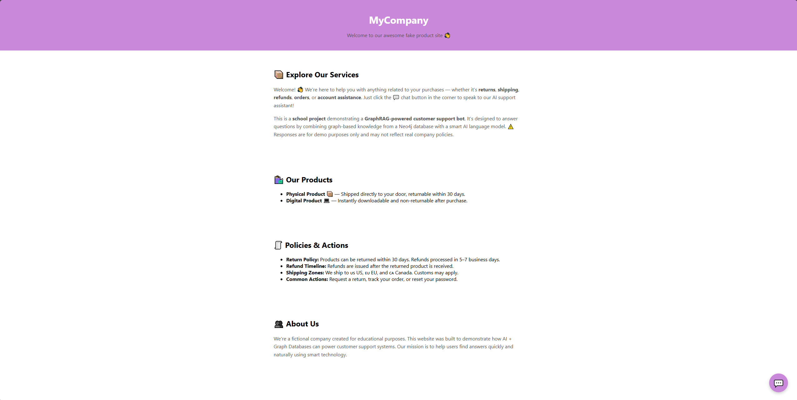
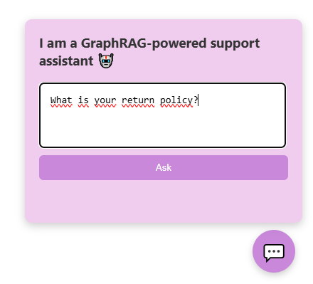
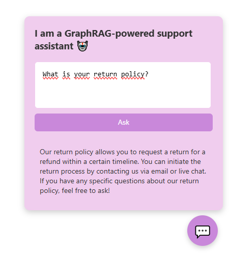
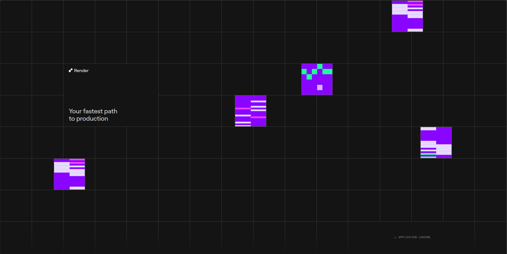
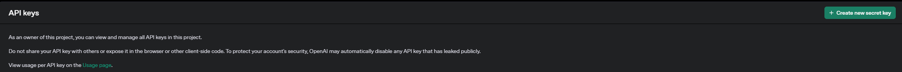
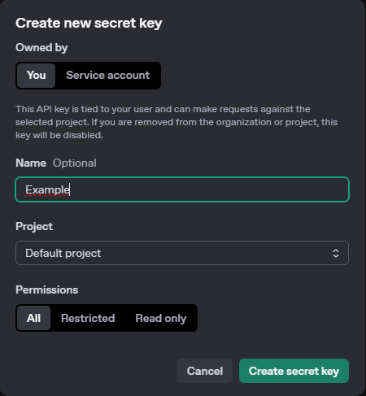
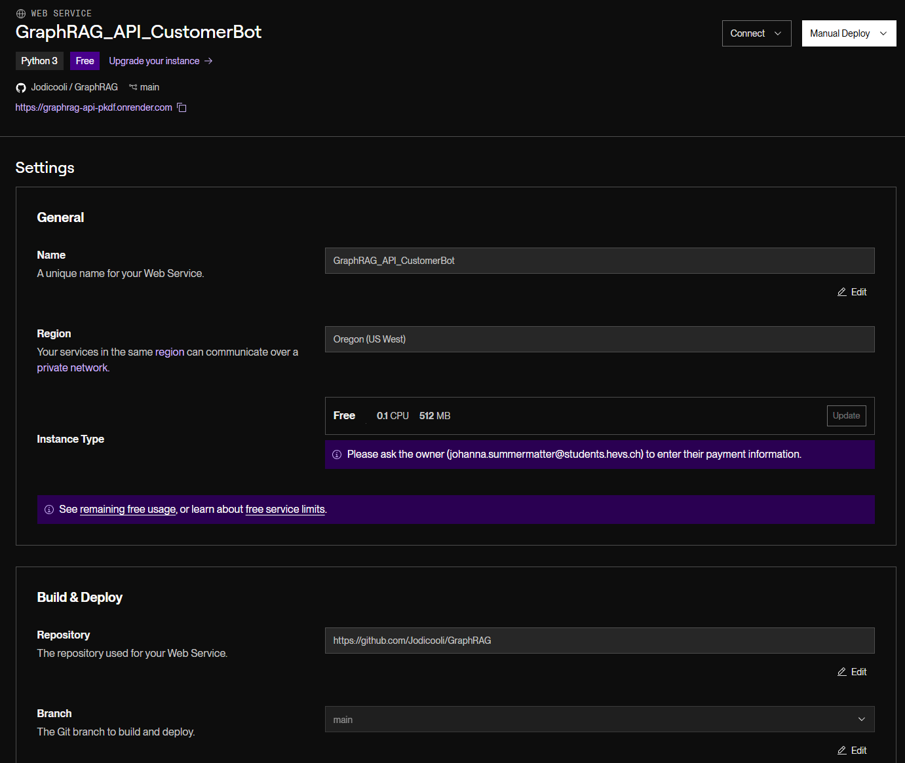
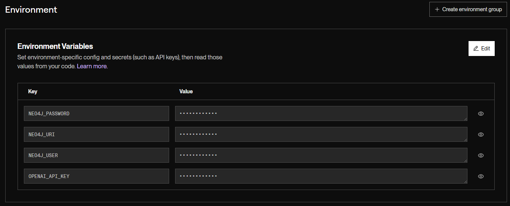
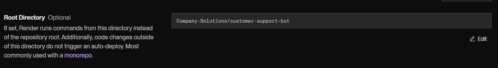

# AI Customer support Bot

This project is a **GraphRAG-powered AI assistant** designed to help customers get quick answers to common support questions — such as returns, shipping, orders, and more. The system combines a **graph database (Neo4j)** with **vector search (FAISS)** and **LLM-based reasoning (OpenAI)** to deliver smarter responses than traditional keyword-based bots.

A lightweight **frontend web UI** simulates a real company website, where the chatbot is accessible via a floating 💬 button in the bottom-right corner.

---

## Here some impressions of the website:

### 1. Homepage


### 2. Chatbot open



### 3. Bot response



---

## Live demo

You can access the hosted version (if active and online) here:

**[Click to Try the Bot (on Render)](https://graphrag-api-pkdf.onrender.com/)**

_Please note: This app is hosted on **Render’s free tier**, which means the backend may go offline after inactivity. If the site doesn't load immediately, give it a few seconds to wake up._


---

## Technologies used

| Layer            | Technology |
|------------------|------------|
| Database         | Neo4j (graph structure: Topics, Policies, Products, Actions) |
| Vector Search    | FAISS (semantic similarity over knowledge chunks) |
| LLM Integration  | OpenAI API (chat-based completions) |
| Backend          | FastAPI (Python-based REST API) |
| Frontend         | HTML + CSS + JS  |
| Hosting          | Render (API + frontend deployment) |

---

## How it works

### 1. **Graph-Based knowledge**

All customer support knowledge is modeled in a **Neo4j graph** with relationships like:

- `(:Topic)-[:COVERS]->(:Policy)`
- `(:Policy)-[:ALLOWS]->(:Action)`
- `(:Topic)-[:CONTACT_VIA]->(:Channel)`

Example:  
"Returns" → covers → "Return Policy" → allows → "Request Return"

This allows the bot to retrieve **contextually connected** information.

---

### 2. **Vector index with FAISS**

We extract structured knowledge chunks from Neo4j like:

```text
"Topic: Returns. Related: Return Policy, Refund Timeline, Email, Live Chat"
```

These are embedded using sentence-transformers and stored in FAISS for fast semantic retrieval.

---

### 3. AI response with openAI

When a user submits a question:

1. The query is embedded and matched to relevant knowledge chunks via FAISS.

2. The graph context for the matched topic is also retrieved from Neo4j.

3. A prompt is constructed and sent to OpenAI’s API to generate the answer.

---

### 4. FastAPI backend

The backend exposes one main route:

```http
GET /ask?query=your-question
```

It handles:

- FAISS retrieval

- Neo4j querying

- Prompt formatting

- AI response handling

---

### 5. Web UI with floating chatbot
The frontend is a static HTML page that simulates a fictional company. A floating 💬 button toggles the chat panel.

The chat panel:

- Accepts user input

- Sends it to the FastAPI backend

- Displays the AI response

The UI is made with HTML/CSS/JS.

---

## Why is this helpful for companies?

This kind of assistant is ideal for companies that want lightweight, AI-powered customer support without needing to outsource or build massive platforms.

Benefits:
- Smarter answers via reasoning (not just keyword search)

- Easy integration — add a <script> and embed the chat bot in any webpage

- Works with structured knowledge (graphs), making it great for:

    - FAQs

    - Support documents

    - Policies & rules

- Customizable responses and prompts

---

## Use cases for companies

This chatbot architecture could help with:

| Industry            | Use case |
|------------------|------------|
| E-Commerce         | Returns, orders, shipping support |
| Logistics    | Track packages, update delivery info |
| Insurance  | Claim processes, document submission |
| Healthcare          | Appointments, prescriptions, FAQs |
| Education         | Course info, deadlines, enrollment  |

---

## When GraphRAG might not be the best fit

While GraphRAG is powerful — especially for structured, relationship-rich knowledge — it’s not always the ideal solution. In some cases, simpler or alternative architectures can be more efficient, especially when:

- **Your data is flat or unstructured**
If you're working with isolated FAQ-style documents or text blobs without clear relationships, a standard RAG pipeline (vector search + LLM) may be easier and faster.

- **Speed is a top priority**
Graph traversal and combining graph + vector context can be slower than just embedding and retrieving text chunks.

- **Your team lacks graph modeling experience**
Designing, maintaining, and querying a knowledge graph (Neo4j) requires a learning curve.

- **Maintenance is critical**
Graph structures need to stay clean and up-to-date — messy or outdated graphs can lead to worse performance than simpler systems.

---

## When simpler LLM-based solutions may be better

- Small or simple datasets — A lightweight retrieval system (like just FAISS + OpenAI) might be all you need.

- No complex relationships — If there are no dependencies between items, a graph might not add much value.

- Pre-trained retrieval services — Some providers (like OpenAI’s RAG, LangChain’s retrievers, etc.) offer simpler plug-and-play solutions without requiring custom graph logic.

---

## How to run locally

```bash
# Install requirements
pip install -r requirements.txt

# Make sure your .env contains:
NEO4J_URI=...
NEO4J_USER=...
NEO4J_PASSWORD=...
OPENAI_API_KEY=...

# Build the FAISS index
python indexer/build_index.py

# Start the FastAPI app
uvicorn api.main:app --reload

# Open index.html in browser (frontend/index.html)
```

---

## How we created an OpenAI key

1. Go to https://platform.openai.com/api-keys 

2. Click on "Create new secret key"
   


4. Enter a name for the key
   


6. Copy and save your key

Save your secret key in a safe place since you won't be able to view it again. 

---

## How we deployed our website

We deployed our full GraphRAG-powered customer support system using Render.com — a free, cloud-based platform that supports web services and static sites.

### Deployment Steps

1. We first pushed our code to our GitHub repository.

2. On www.render.com, we created a Web Service:

    - This service handles both:

        - The FastAPI backend for AI responses

        - And serves the HTML frontend manually through a FastAPI static file route


3. We configured the backend with environment variables using Render’s Environment Settings:

    - NEO4J_URI – Your AuraDB connection string

    - NEO4J_USER – Database username

    - NEO4J_PASSWORD – Database password

    - OPENAI_API_KEY – For calling OpenAI models 
 

4. We set the correct Root Directory to:
    _Company-Solutions/customer-support-bot_
    → This ensures Render runs the project from inside the monorepo.


5. We built the FAISS index locally and committed the files (.bin and .pkl) into the index/ folder so the API can load them on startup.

### Free tier limitations

Since Render’s free plan sleeps inactive services, the backend may take **2 - 5 minutes** to wake up after periods of inactivity. During that time, the frontend might appear stuck on a loading screen — but once the API is active, everything works smoothly.

---

## Notes

- Free hosting on Render means the app may sleep when idle.

- API responses depend on the OpenAI key — make sure your key is active.

- Neo4j needs to be populated before querying (you’ll find the import script in the data/ folder).

---

## Folder Structure

```text
customer-support-bot/
├── api/                 # FastAPI backend
├── dal/                 # Neo4j handler
├── indexer/             # FAISS index builder
├── llm/                 # Prompt + OpenAI logic
├── frontend/            # Static HTML + CSS
├── data/                # Neo4j import script
├── config/              # .env + settings
├── requirements.txt
├── README.md
```

---
