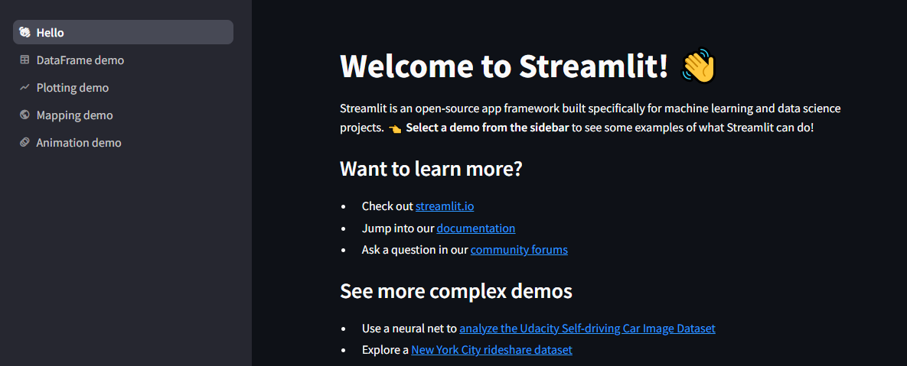
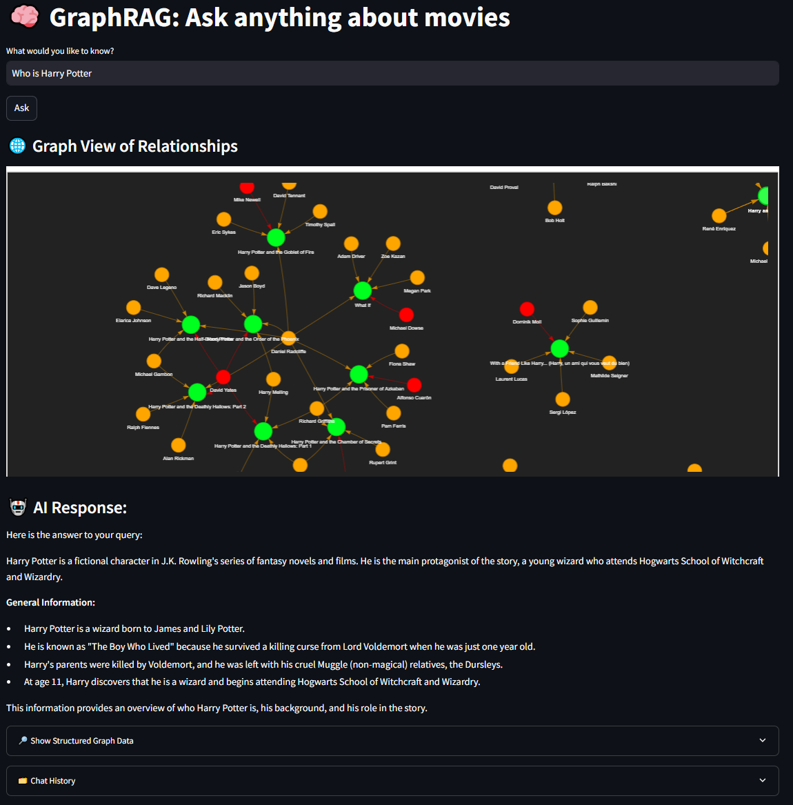

# Streamlit - UI for our GraphRAG application

## What is Streamlit?

**Streamlit** is an open-source Python framework that makes it easy to build **interactive web apps** for data science and machine learning projects — **without needing HTML, CSS, or JavaScript**.

It turns Python scripts into beautiful, shareable apps in just a few lines of code. Perfect for visualizing model outputs, working with charts, or creating quick dashboards.

---

## Installation

You can install Streamlit using pip (already in the requirements.txt file):

```bash
pip install streamlit
```

To verify the installation:

```bash
streamlit hello
```

This will launch a sample demo in your browser.



## How It’s Used in This Project

In this GraphRAG project, Streamlit serves as the **frontend interface** that allows users to:

- Input natural language questions about movies

- View answers generated by the local LLM

- Explore graph relationships (actors → movies → genres) via visualizations

- Track chat history during the session

- It communicates with the FastAPI backend and renders data visually based on the LLM's instructions (<SHOW_GRAPH>).

---

## Running Streamlit

To start the Streamlit app, run the following command from the root directory of the project:

```bash
streamlit run frontend/app.py
```

This will launch the app in your browser at http://localhost:8501


## Why We Used Streamlit

We chose Streamlit because it:

- Was fast to set up

- Required no front-end knowledge

- Allowed seamless integration with Python

- Provided the flexibility to show text, charts, and graphs based on the LLM's response

In short: it made building an interactive UI for our GraphRAG system easy and fast.

---

## Advantages of Streamlit

- **Quick Setup**: Build apps with just Python — no web development skills required  
- **Great for Prototypes**: Ideal for hackathons, demos, and fast experimentation  
- **Real-Time Interaction**: Automatically updates the app when a file or input changes  
- **Markdown Support**: Easily add titles, code, tables, and emojis using Markdown  
- **Community & Open Source**: Supported by a large community with lots of tutorials and plugins  

---

## Disadvantages of Streamlit

- **Limited UI Customization**: Not ideal for building highly styled or complex UIs  
- **Less Control**: Compared to frameworks like React or Flask, you get less control over layout and logic  
- **Single-page Apps**: Follows a reactive execution model — not designed for multi-page routing  
- **Performance Limitations**: May struggle with large-scale, concurrent workloads if not optimized  

---

## Alternatives to Streamlit

| Tool             | Description                                         | Best For                             |
|------------------|-----------------------------------------------------|--------------------------------------|
| **Gradio**        | Simple interface for ML models, very intuitive      | ML demos, LLM playgrounds            |
| **Dash (Plotly)** | More powerful & customizable, supports callbacks   | Interactive data dashboards          |
| **Shiny (Python)**| Port of R’s Shiny, now available in Python         | Statistical/data-driven apps         |
| **Flask + HTML**  | Traditional full-stack development                 | Custom and fully styled web apps     |

---

## Summary

Streamlit was the perfect fit for this GraphRAG project because it’s **fast**, and **user-friendly**.  
It helped us build an interactive movie assistant UI — including **graph visualizations** — without any frontend coding.

While it’s not designed for heavy customization or production-scale web apps, it’s perfect for **prototypes** and **LLM interfaces**.

---

## References for this readme file:
- https://streamlit.io/
- https://github.com/streamlit/streamlit
- https://docs.streamlit.io/
- https://softwaremill.com/pros-and-cons-of-using-streamlit-for-simple-demo-apps/
- https://www.gradio.app/
- https://dash.plotly.com/
- https://shiny.posit.co/py/
- https://clickup.com/blog/streamlit-alternatives/