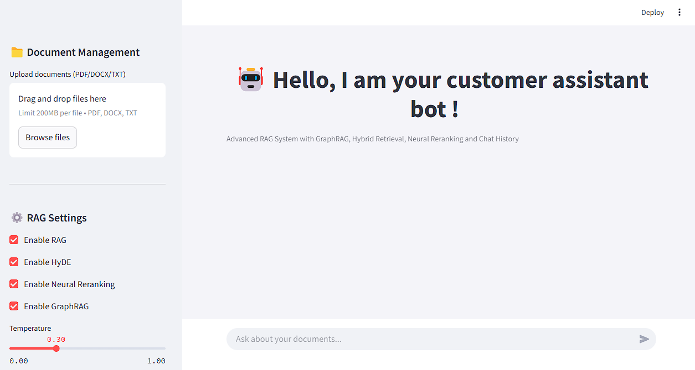
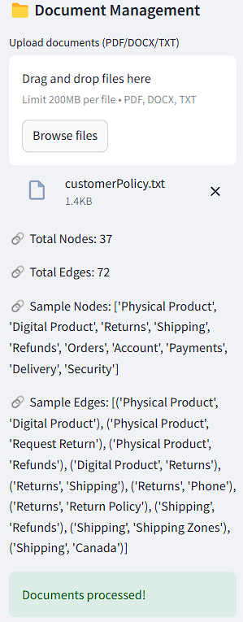
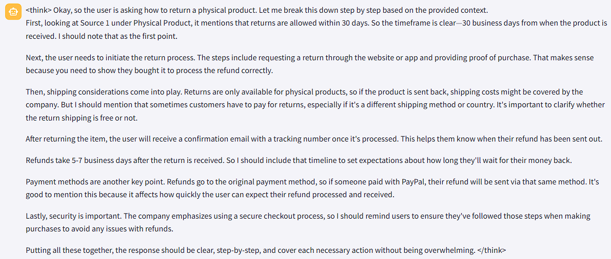

# **DeepSeek GRAPHRAG Chatbot**
 
**DeepSeek + NOMIC + FAISS + Neural Reranking + HyDE + GraphRAG + Chat Memory**
 
This chatbot enables **fast, accurate, and explainable retrieval of information** from PDFs, DOCX, and TXT files using **DeepSeek-7B**, **BM25**, **FAISS**, **Neural Reranking (Cross-Encoder)**, **GraphRAG**, and **Chat History Integration**.
 
---
 
## Here some impressions of the website:
 
### 1. Homepage

 
### 2. Document Feeding
 

 
### 3. Bot Thinking
 

 
 
---
 
# **Technologies Used**
 
| Layer                    | Technology & Details                                                               |
| ------------------------ | ---------------------------------------------------------------------------------- |
| LLM Generation           | DeepSeek-7B via Ollama (chat-based completions)                                    |
| Document Retrieval       | BM25 & FAISS (hybrid retrieval and semantic similarity over knowledge chunks)      |
| Neural Reranking         | Cross-Encoder (ms-marco-MiniLM-L-6-v2 for reordering retrieved passages)           |
| Graph Processing         | GraphRAG (building and visualizing the knowledge graph)                            |
| Chat Interface           | Streamlit (interactive web UI for chatbot interactions)                            |
| Deployment & Environment | Python venv & Docker (flexible local and containerized deployments)                |
 
---
 
# **Installation & Setup**
 
You can install and run the **DeepSeek GRAPHRAG Chatbot** in one of two ways:
 
1. **Traditional (Python/venv) Installation**
2. **Docker Installation** (ideal for containerized deployments)
 
---
 
## **1️⃣ Traditional (Python/venv) Installation**
 
### **Step A: Install Dependencies**
 
```
cd Customer_Support_LocalBot
 
# Create a virtual environment
python -m venv venv
 
# Activate your environment
# On Windows:
venv\Scripts\activate
# On macOS/Linux:
source venv/bin/activate
 
# Upgrade pip (optional, but recommended)
pip install --upgrade pip
 
# Install project dependencies
pip install -r requirements.txt
```
 
### **Step B: Download & Set Up Ollama**
 
1. **Download Ollama** → [https://ollama.com/](https://ollama.com/)
2. **Pull the required models**:
 
   ```
   ollama pull deepseek-r1:7b
   ollama pull nomic-embed-text
   ```
 
   *Note: If you want to use a different model, update `MODEL` or `EMBEDDINGS_MODEL` in your environment variables or `.env` file accordingly.*
 
### **Step C: Run the Chatbot**
 
1. Make sure **Ollama** is running on your system:
   ```
   ollama serve
   ```
2. Launch the Streamlit app:
   ```
   streamlit run app.py
   ```
3. Open your browser at **[http://localhost:8501](http://localhost:8501)** to access the chatbot UI.
 
---
 
## **2️⃣ Docker Installation**
 
### **A) Single-Container Approach (Ollama on Your Host)**
 
If **Ollama** is already **installed on your host machine** and listening at `localhost:11434`, do the following:
 
1. **Build & Run**:
   ```
   docker-compose build
   docker-compose up
   ```
2. The app is now served at **[http://localhost:8501](http://localhost:8501)**. Ollama runs on your host, and the container accesses it via the specified URL.
 
### **B) Two-Container Approach (Ollama in Docker)**
 
If you prefer **everything** in Docker:
 
```
version: "3.8"
 
services:
  ollama:
    image: ghcr.io/jmorganca/ollama:latest
    container_name: ollama
    ports:
      - "11434:11434"
 
  deepgraph-rag-service:
    container_name: deepgraph-rag-service
    build: .
    ports:
      - "8501:8501"
    environment:
      - OLLAMA_API_URL=http://ollama:11434
      - MODEL=deepseek-r1:7b
      - EMBEDDINGS_MODEL=nomic-embed-text:latest
      - CROSS_ENCODER_MODEL=cross-encoder/ms-marco-MiniLM-L-6-v2
    depends_on:
      - ollama
```
 
Then:
 
```
docker-compose build
docker-compose up
```
 
Both **Ollama** and the chatbot run in Docker. Access the chatbot at **[http://localhost:8501](http://localhost:8501)**.
 
### **But consider step A) for comfort..**
 
---
 
# **How the Chatbot Works**
 
1. **Upload Documents**: Add PDFs, DOCX, or TXT files via the sidebar.
2. **Hybrid Retrieval**: Combines **BM25** and **FAISS** to fetch the most relevant text chunks.
3. **GraphRAG Processing**: Builds a **Knowledge Graph** from your documents to understand relationships and context.
4. **Neural Reranking**: Uses a **Cross-Encoder** model for reordering the retrieved chunks by relevance.
5. **Query Expansion (HyDE)**: Generates hypothetical answers to **expand** your query for better recall.
6. **Chat Memory History Integration**: Maintains context by referencing previous user messages.
7. **DeepSeek-7B Generation**: Produces the final answer based on top-ranked chunks.
 
---
 
# **Folder Structure**
 
```
Customer_Support_LocalBot/
├── app.py                          # Main Streamlit application
├── README.md                       # Project overview and setup instructions
├── requirements.txt                # Python dependencies
├── .env                          # Environment configuration variables
├── docker-compose.yml              # Docker configuration (if using Docker)
├── Dockerfile                      # Dockerfile for building the app image (if applicable)
├── utils/                          # Utility modules
│   ├── retriever_pipeline.py       # Document retrieval pipeline (BM25 & FAISS)
│   ├── doc_handler.py              # Document processing and handling
│   └── visualization.py            # Graph visualization utilities
└── images/                         # Assets for README illustrations
    ├── HomePage.png                # Homepage screenshot
    ├── feeding.png                 # Document feeding screenshot
    └── thinking.png                # Bot thinking screenshot
```
---
 
# **Credits**
The original creator of this project is mentioned in the license file. Modifications were done by providing
1. A special context for our customer policy text.
2. A new layout that includes graph modification parameters
3. A graph visualizer that indicated the related nodes on a query