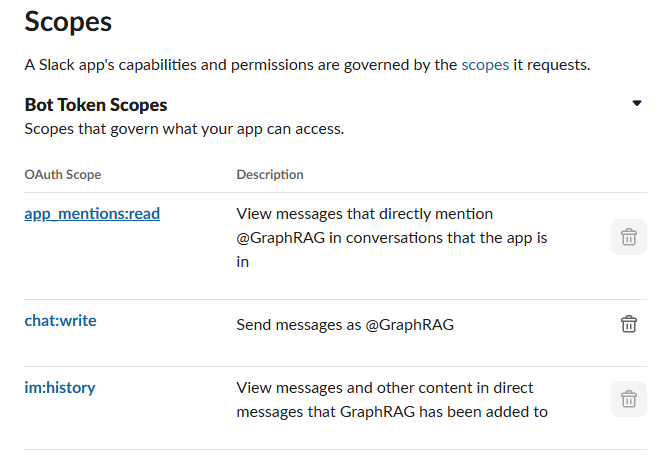
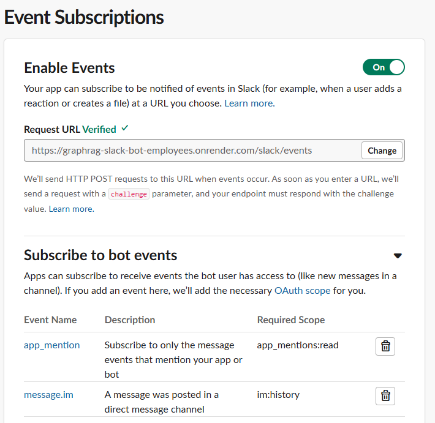
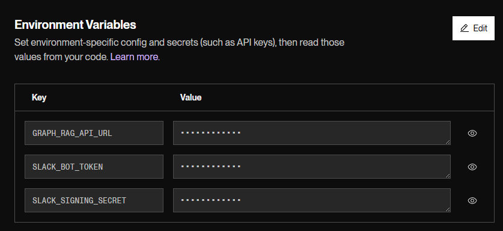
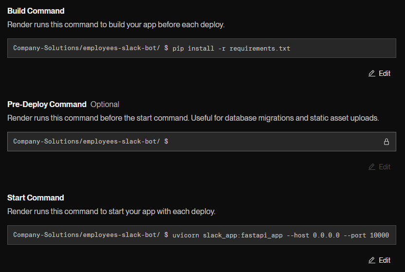
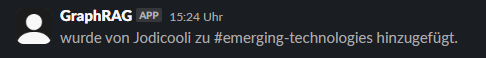
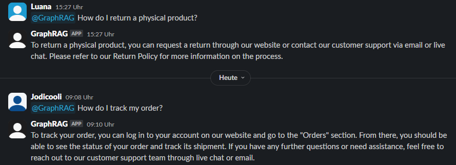

# GraphRAG Slack Bot for employees

This Slack bot is an internal AI assistant built to help employees get quick answers about company policies, shipping rules, account access, and more. It uses the same logic and backend as the customer GraphRAG bot application, but is integrated into Slack for internal use.

---

## Overview

- **Backend:** FastAPI (already deployed)

- **LLM:** OpenAI (via `/ask` endpoint)

- **Graph Database:** Neo4j (stores structured knowledge such as policies, products, actions)

- **Vector Search:** FAISS index built from Neo4j data

- **Slack Integration:** Slack Events API + Slack Bolt SDK

Employees can mention the bot inside Slack and ask questions like:

- @GraphRAG Can I return a physical product?
- @GraphRAG Where do we ship to?


The bot will return a graph-aware, AI-generated response based on your internal knowledge base.

---

## How it works

1. When a user **mentions the bot in Slack**, the app receives the event.

2. It extracts the query and **forwards it to the deployed GraphRAG API** via a simple HTTP call.

3. The backend performs:

   - Vector search (FAISS)

   - Graph reasoning (Neo4j)

   - Natural language generation (OpenAI)

4. The bot **responds in Slack** with an answer.

---

## Setup instructions

### 1. Slack Setup

You need to create a Slack App via [https://api.slack.com/apps](https://api.slack.com/apps)

- **Enable Scopes:**
  
  - `chat:write`
  
  - `app_mentions:read`
  
  - `channels:history`

    

- **Enable events:**
  
  - Turn ON "Event Subscriptions"
  
  - Set your Request URL to:
    ```
    https://your-slack-bot-service.onrender.com/slack/events
    ```
  - Subscribe to event: `app_mention`

    

### 2. Deployment

The Slack app was deployed using [Render.com](https://render.com):

- One **Web Service** runs the Slack FastAPI app (`slack_app.py`)

- The GraphRAG backend is hosted separately and reused via HTTP

- Environment variables were configured in Render’s dashboard

  ```env
  SLACK_BOT_TOKEN=your_slack_bot_token 
  SLACK_SIGNING_SECRET=your_slack_signing_secret 
  GRAPH_RAG_API_URL=https://your-api.onrender.com
  ```

`GRAPH_RAG_API_URL` should point to the already deployed FastAPI GraphRAG backend that handles `/ask?query=...`



- To start the app we used:

  ```bash
  uvicorn slack_app:fastapi_app --host 0.0.0.0 --port 10000
  ```

  

---

## How to test

Once deployed:

1. Invite the bot to a channel in Slack

  

2. Mention it and ask a question:

  @GraphRAG How do I reset my password?

  You should get a friendly AI-generated answer.

  

---

## Advantages

- **Reuses the same GraphRAG backend** as the customer bot
- **Context-aware** answers thanks to vector + graph retrieval

---

## Limitations

- Requires a deployed backend to function (not offline-capable)
- Responses depend on the quality of data in Neo4j

---

## Microsoft Teams integration

We also explored adding this bot to **Microsoft Teams** using the Azure Bot Framework. The integration is technically possible using:

- `botbuilder-core`
- `/api/messages` as the messaging endpoint

However, **due to permission restrictions**, we couldn’t complete the Teams integration during testing.

---

## Summary
This Slack bot provides a lightweight, smart way for employees to access company knowledge via chat. Built on top of the same GraphRAG foundation, it ensures consistency in responses across internal and external use cases.