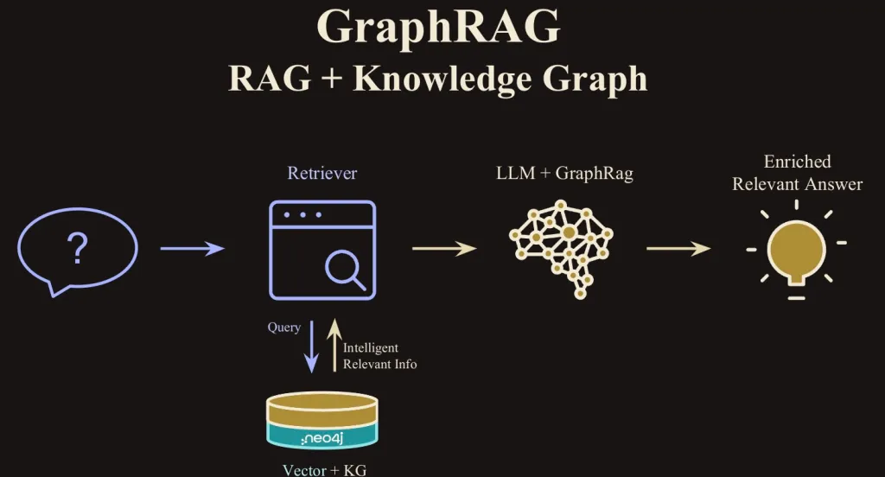

# Graph RAG

This README file contains theory aspects as well as practical examples about GraphRAG and its usage. 

## Table of Contents

1. [Introduction](#introduction)
2. [Background &amp; History](#background--history)
3. [Key Concepts &amp; Theoretical Foundations](#key-concepts--theoretical-foundations)
4. [Applications &amp; Use Cases](#applications--use-cases)
5. [Exploring Graph RAG in Practice](#exploring-graph-rag-in-practice)
6. [To be defined](#to be defined)
7. [Comparing Graph RAG with Alternative Approaches](#comparing-graph-rag-with-alternative-approaches)
8. [Conclusion and Next Steps](#conclusion-and-next-steps)
9. [References](#references)

---

## 1. Introduction

Retrieval-Augmented Generation (RAG) is a method that improves AI responses by combining a search system with a generative model. However, RAG has limitations in understanding complex relationships between concepts.

Knowledge graphs help solve this issue by structuring information as connected entities and relationships. Graph RAG builds on this idea by integrating knowledge graphs into RAG, leading to more accurate and context-aware responses.

This project explores how Graph RAG enhances AI retrieval and generation, its applications, and how to build a custom knowledge graph for better AI understanding.

## 2. Background & History

### Evolution of AI-Assisted Retrieval Systems

AI-assisted recovery systems have evolved significantly over time to become smarter and more precise. ( *Evolution Of AI In Information Retrieval | Restackio* , s. d.)

* Traditional search engines (1990s - 2000s): These use keyword search and page ranking algorithms (such as PageRank). Their main drawback is that they don't really understand the context of queries, which can lead to irrelevant results. ( *Définition du PageRank - Agence SEO.fr* , 2024)

* NLP-based search models (2000s - 2010s): Models such as TF-IDF and Word2Vec have been developed to better understand the meaning of words and their importance in context. TF-IDF measures word relevance based on frequency and distribution, while Word2Vec captures semantic relationships by representing words as vectors. However, these models do not take context into account. A word will always have the same meaning, regardless of the surrounding words in the sentence. (Fokou, 2019)

* Transformers and pre-trained models (2017 - Present): The introduction of Transformers (e.g. BERT, RoBERTa) has revolutionized search systems by enabling better understanding of complete sentences. These models use attention mechanisms to analyze all the dependencies between words in a sentence, enabling them to capture the overall context. Unlike previous models, they give different meanings to words depending on context, resulting in a better understanding of sentences and more accurate results. (Fokou, 2019)

* RAG (Retrieval-Augmented Generation) (2020 - Present): Introduced by Facebook AI in 2020, RAG combines an intelligent search engine with a generative model to produce answers based on relevant documents. This approach significantly improves the accuracy of answers by using up-to-date information from external sources, while generating coherent, contextually appropriate texts. (Merritt, 2025)

* GraphRAG (2024 - Present): GraphRAG is an enhancement to RAG that uses graphs to organize and link information. Instead of just using conventional databases. This makes it easier to understand the relationships between concepts, and improves the accuracy of answers, particularly for complex questions requiring several stages of reasoning. ( *Welcome - GraphRAG* , s. d.-b)

### The Development of RAG and Its Limitations

The main idea behind RAG is to combine the advantages of search systems (contextual accuracy) with those of generative models (fluidity and creativity).

Limitations of RAG :

* The quality of answers depends on the quality and relevance of the documents retrieved. (Harsh & Harsh, 2024)

* RAG doesn't really understand the complex relationships between concepts. For example, it might not make the connection between “CEO” and “company director” without having seen these terms used together in a document. (Harsh & Harsh, 2024)

* The generative model can introduce inconsistencies if documents are contradictory. (Harsh & Harsh, 2024)

### How Knowledge Graphs Enhance AI Understanding

Knowledge Graphs provide a solution to the limitations of RAG by providing a semantic and relational structure to information.

* Unlike a traditional database, a Knowledge Graph links entities (nodes) by relationships (edges). For example

  * Entities: “Steve Jobs”, “Apple Inc.”, “iPhone”.

  * Relationships: “founded”, “created”.
   
   This enables AI to understand not only words, but also the relationships between them.

* A Knowledge Graph helps AI distinguish between similar concepts using relational context. For example, it can differentiate “Apple” (company) from “apple” (fruit) based on relationships (“founded” vs. “part of”).

* AI can use relationships to deduce new information. For example, if “Steve Jobs founded Apple” and “Apple created the iPhone”, the AI can deduce that “Steve Jobs helped create the iPhone”.

* By combining GraphRAG with RAG, the Knowledge Graph is used to augment queries by providing relevant context. This makes it possible to ask more precise questions and obtain more relevant answers.

## 3. Key Concepts & Theoretical Foundations

### Fundamentals of Retrieval-Augmented Generation (RAG), Knowledge Graphs, and Graph RAG  
RAG combines **information retrieval** and **text generation**, allowing AI to fetch relevant knowledge before constructing responses. 

Graph RAG enhances this by structuring information in a **network of interconnected concepts**, improving contextual understanding.

### How RAG Works: Retrieval and Generation 

- **Retrieval Phase**: The system searches a knowledge base for relevant documents before generating a response.  

- **Generation Phase**: It synthesizes the retrieved knowledge to produce a clear and contextually relevant answer.  

### The Role of Graphs in AI and Knowledge Representation 

- Graph RAG represents information as a **network of linked concepts** rather than isolated documents.  

- For example, in understanding *electric cars*:  

  - "Electric car" → "Battery"  

  - "Battery" → "Lithium"  
  
  - "Lithium" → "Mining industry"  

- These connections improve knowledge structuring and response accuracy.

### Advantages and Challenges of Using Graph RAG  

#### **Advantages**  

**More accurate responses** – Finds the most relevant information dynamically.  

**Better contextual understanding** – Connects related concepts for improved comprehension.  

**Verifiable answers** – Can cite sources, enhancing reliability.  

#### **Challenges**  

**Managing large data volumes** – Organizing and retrieving vast amounts of information efficiently.  

**Keeping knowledge up to date** – Regular updates are required to maintain accuracy.  

**Ensuring quality relationships** – Conceptual connections must remain relevant and meaningful.  

### 3.1 What is RAG ?

Retrieval-Augmented Generation (RAG) is an approach that enhances traditional generative models by incorporating a retrieval step. Instead of relying solely on the training data, RAG systems actively search for relevant external information, which helps generate responses that are more accurate, current, and grounded in real-world data.

**Two-Step Process:**

1. **Retrieval:** When a query is made, the system first searches through a large repository of documents or data to fetch the most relevant pieces of information.

2. **Generation:** The generative model then uses this retrieved context to produce a response that is not only coherent but also enriched with factual data from the external sources.

**Addressing Limitations of Standalone Generative Models:**

Traditional language models may “hallucinate” details or provide outdated responses because they rely solely on static training data. RAG overcomes this limitation by dynamically retrieving the most pertinent and up-to-date information, which helps improve the accuracy and reliability of the output.

**Enhancements and Further Insights (from IBM Research):**

IBM Research further elaborates on this concept by emphasizing that RAG combines neural retrieval techniques with generative models to create a more robust and flexible framework. According to their research, this method allows the system to:

* **Adapt to Domain-Specific Tasks:** By fine-tuning both the retrieval and generation components, RAG can be tailored to meet the demands of specialized applications, ensuring higher performance and relevance in particular domains (Martineau, 2024).

* **Improve Responsiveness:** The retrieval component can quickly sift through extensive datasets using advanced indexing methods, enabling the model to promptly incorporate the latest information (Martineau, 2024).

* **Mitigate Knowledge Decay:** As models age, their training data can become outdated. RAG addresses this by continuously pulling in fresh, external information during the generation process, thereby maintaining relevance over time (Martineau, 2024).

### 3.2 The Role of Graphs in AI and Knowledge Representation

Graphs play a crucial role in knowledge representation, especially in the context of AI. They provide a flexible and intuitive way to structure and visualize complex relationships between entities. In AI, graphs are used to represent a wide range of data, from knowledge graphs and semantic networks to social networks and biological data.

**Why Graphs Matter in AI:**

1. **Representation of Relationships:** Graphs naturally model relationships between entities, where nodes represent entities (e.g., people, places, concepts) and edges represent relationships (e.g., "is related to", "is part of"). This makes graphs highly suitable for tasks such as question answering, reasoning, and information retrieval.

2. **Contextual Understanding:** Graph-based representations enable AI models to not only access facts but also to understand the context in which these facts exist. This helps AI systems answer more sophisticated queries by understanding how different pieces of information relate to each other.

3. **Semantic Reasoning:** Graphs enable semantic reasoning, allowing AI systems to infer new facts or relationships that are not explicitly stated, enhancing the system's ability to handle ambiguous or incomplete information.

**Knowledge Graphs in AI:**
In AI, knowledge graphs are particularly important because they provide structured data that can be queried and reasoned over. By storing facts in a graph format, systems can quickly retrieve relevant data and infer new insights. For instance, a knowledge graph about medical conditions can help a diagnostic AI model infer potential diagnoses based on symptoms and historical data.

### 3.3 Advantages and Challenges of Using Graph RAG

Graph-based RAG, which integrates retrieval-augmented generation with graph-based knowledge representation, offers a variety of benefits but also presents certain challenges.

**Advantages of Graph RAG:**

1. **Improved Accuracy and Relevance:**
   * By combining the retrieval process with graph-based data, Graph RAG can provide responses that are not only grounded in real-world data but also contextually rich. The relationships between entities stored in a graph allow the generative model to produce more accurate and relevant answers.

2. **Better Handling of Complex Queries:**
   * Complex queries that involve multiple relationships or require reasoning across different data points can benefit significantly from graph-based retrieval. The structure of the graph helps the retrieval process find more comprehensive and interconnected information, which can then be used by the generator to form a more detailed response.

3. **Dynamic and Adaptive Responses:**
   * Just like RAG systems, Graph RAG benefits from dynamic retrieval. However, in this case, the retrieval step is guided by the graph's inherent structure, allowing the system to adapt more flexibly to different domains. This ensures that even domain-specific queries can be answered with high accuracy.

4. **Scalability:**
   * As knowledge grows, so does the graph, allowing the model to scale seamlessly. By continuously adding new data to the graph, the system can maintain up-to-date knowledge without the need for re-training the generative model.

**Challenges of Graph RAG:**

1. **Complexity of Graph Construction:**
   * Constructing and maintaining high-quality knowledge graphs can be challenging, especially when dealing with large, unstructured data sources. It requires careful data modeling, validation, and continuous updates to ensure the graph remains accurate and comprehensive.

2. **Integration Complexity:**
   * Integrating graph-based retrieval with generative models can be technically challenging. The generative model must be capable of interpreting the graph's structure and using it to inform its responses. This often requires custom architectures and additional preprocessing steps to align the retrieved data with the model's input format.

3. **Computational Overhead:**
   * The retrieval process in Graph RAG often requires sophisticated algorithms to search and traverse the graph, especially as the size of the graph grows. This can introduce computational overhead, making the system slower compared to traditional RAG models. Optimizing graph retrieval methods is crucial to ensure real-time performance.

4. **Handling Ambiguity and Uncertainty:**
   * Graph-based systems may struggle with ambiguous relationships or incomplete graphs. If the graph lacks sufficient connections or data points, the retrieval process may miss crucial context, resulting in less accurate or incomplete answers.

## 4. Applications & Use Cases

### Why use GraphRAG

As already explained in the chapters above GraphRAG is an enhanced version of Retrieval-Augmented Generation that integrates knowledge graphs into the retrieval process. While traditional RAG relies only on vector similarity to find relevant information, GraphRAG extracts entities and relationships, creating a structured semantic network of knowledge (SivaParam, 2024).

#### But why does this matter?
- Better Contextual Understanding – Instead of retrieving disconnected documents, GraphRAG captures the meaning behind words and their relationships, leading to more accurate results (Bouchard, 2024).

- Multi-Hop Reasoning – Complex queries often require linking multiple pieces of information (e.g., “How does Theory A relate to Research B?”). GraphRAG enables relationship-based retrieval, reducing hallucinations (Bouchard, 2024).

- Improved Query Handling – If users ask high-level or meta-questions (e.g., “How many research papers on RAG were published in 2023?”), GraphRAG can navigate the data structure more effectively than traditional methods (Bouchard, 2024).

- Optimized for Structured Data – If your dataset already contains interconnected information (e.g., citations in academic papers, linked legal documents, or organizational knowledge bases), GraphRAG outperforms standard RAG (Bouchard, 2024).

#### When should you use GraphRAG?
- When your data is **naturally structured as a graph** (e.g., legal documents, research papers, corporate knowledge bases) (Bouchard, 2024).

- When queries require **deep reasoning** (e.g., multi-document comparisons, cause-and-effect relationships) (Bouchard, 2024).

- When reducing hallucinations is critical, and factual consistency is a priority (Bouchard, 2024).

- Your knowledge base is large and constantly evolving (e.g., dynamic research data, market trends) (Korland, 2025).

- Your domain benefits from **structured connections between entities** (e.g., scientific citations, regulatory dependencies) (Korland, 2025).
  
#### When to avoid GraphRAG?
- Your data consists of **independent documents without meaningful relationships** (Bouchard, 2024).

- GraphRAG requires more computation and processing time, so if your use case is simple, it may not be necessary (Bouchard, 2024).

- You need fast, real-time responses (GraphRAG can be slower than basic RAG) (Korland, 2025).

- You **lack structured data** or the resources to build a knowledge graph (Korland, 2025).
  
### Examples of sectors where GraphRAG works well
Key sectors where GraphRAG proves valuable include:

#### Healthcare 

- **Medical Diagnosis**: Assists healthcare professionals by integrating patient histories, clinical data, and medical literature for precise diagnostic suggestions (Sparkbit, 2025).

- **Drug Research**: Identifies complex relationships between genes, proteins, and compounds, accelerating biomedical discoveries (Sparkbit, 2025).

- **Treatment Planning**: Personalizes care by analyzing genetic data, medical history, and research to recommend the most effective treatments (Sparkbit, 2025).

#### Finance

- **Fraud Detection**: Maps connections between transactions and accounts to identify anomalies and hidden fraudulent activities (Sparkbit, 2025).

- **Risk Management**: Assesses market trends, economic indicators, and financial statements for more accurate predictions (Sparkbit, 2025).

- **Regulatory Compliance**: Helps financial institutions navigate regulations by structuring legal data and transaction records (Sparkbit, 2025).

#### Customer Service

- **Query Understanding & Ticketing**: Improves multi-step query resolution by linking FAQs, troubleshooting guides, and user history (Sparkbit, 2025).

- **Personalization**: Enhances customer experience by analyzing past interactions and preferences to deliver tailored responses (Sparkbit, 2025).

Across these sectors, GraphRAG acts as an assistive tool for human operators, enabling better decision-making and problem-solving through enhanced AI-driven insights.

### Concrete examples

#### Fraud Detection - Paysafe
Example: **Paysafe**, a payment processing company, uses Oracle’s graph technology to detect fraud.

How GraphRAG Helps:

- Finds hidden connections between fraudulent transactions (Hafeez, 2024)

- Speeds up fraud detection from hours to seconds (Hafeez, 2024)

- Prevents cybercrime by flagging unusual transaction patterns (Hafeez, 2024)

#### Healthcare - Precina 
Precina Health uses GraphRAG and Memgraph to improve care for patients with Type 2 diabetes. Their system, called P3C (Provider-Patient CoPilot), helps doctors make better treatment decisions by combining medical records with behavioral and social data. This approach has led to significant improvements, with patients lowering their HbA1C levels by 1% per month, a much faster rate than usual (Bryan, n.d.).

P3C works by integrating real-time patient inputs, such as insulin levels, lifestyle factors, and even personal challenges like transportation issues or stress. The system connects these data points to find patterns and predict potential health risks. This allows providers to make informed decisions tailored to each patient’s needs, improving both medical outcomes and overall quality of care (Bryan, n.d.).

## 5. Exploring Graph RAG in practice

**Folder structure**
To reflect the different approaches and experiments, our project is organized into multiple self-contained folders, each representing a specific implementation:

- Each folder contains all relevant code, configurations, and examples.

- Each folder also includes its own README file with:

    - Setup & installation instructions

    - Description of the architecture and use case

    - Tool-specific documentation and known issues

This makes it easy to test, compare, or reuse each GraphRAG implementation independently.

**Documentation structure**
Where needed, we also include a documentation/ folder inside the project. This contains:

- Technology-specific guides (e.g., README.neo4j.md, README.faiss.md, README.streamlit.md)

- Installation steps

- Tool advantages/disadvantages

- Alternatives and relevant examples

This helps you understand not just how the tools were used, but why they were chosen.

### 5.1 Creating your own GraphRAG application

Creating your own GraphRAG system — whether through lightweight tools like the graphrag library or full-stack, custom-built architectures — offers a powerful way to experiment, learn, and deliver real value with retrieval-augmented generation and knowledge graphs.

This section outlines both the benefits and downsides of building GraphRAG systems from scratch or via tooling, and how our project was structured around real use cases.

If you want to discover what GraphRAG application we made you can check out the following two fodlers:

- **/Custom_GraphRAG_Application**
- **/GraphRAG_Library**
- **/Customer_Support_Bot**
- **/Employees_Slack_Bot**

#### Benefits of custom GraphRAG implementation

- **Full control and flexibility**
Custom implementations allow you to define exactly how your system retrieves, links, and generates information. You can tune everything: the graph schema, the retrieval strategy, the AI model, and even the UI.

- **Tailored for your domain**
Different domains (healthcare, legal, customer support, etc.) benefit from unique data structures. With your own implementation, you can model domain-specific relationships and customize AI prompts accordingly.

- **Integrate with existing systems**
Custom GraphRAG systems can connect to company databases (e.g., SQL, Neo4j, APIs), enabling use in real-world enterprise settings — something pre-packaged solutions often can’t do.

- **Improve explainability & debugging**
Having full visibility into each component (retrieval, graph traversal, generation) helps with performance tuning, debugging, and transparency — especially critical for high-stakes domains.

#### Downsides and limitations

- **Higher complexity**
Building everything from scratch means handling APIs, infrastructure, data transformation, and model coordination. It takes more effort to get it all working seamlessly.

- **Maintenance Overhead**
Custom pipelines need ongoing care: updating graph data, retraining embeddings, and refactoring as technologies evolve.

- **Steeper Learning Curve**
Beginners might find it overwhelming to manage all layers — from Neo4j queries to LLM prompt tuning and UI deployment.

- **Slower to Build**
Compared to libraries like graphrag, full custom systems are slower to get running — especially when integrating multiple components (FAISS, Neo4j, LLMs, UIs).

#### Conclusion on building a custom GraphRAG system

Creating our own GraphRAG system was a rewarding but time-consuming process. While the end result allowed us to build a powerful, flexible AI assistant, the path to get there came with several challenges.

**It's more time-consuming than expected**
Despite modular design, it took several days until all the parts (retrieval, graph queries, LLM reasoning, UI, and APIs) were integrated and working together properly.

**Prompt engineering is a real challenge**
Designing the right AI prompt for responses was much harder than we thought. We tested and iterated through dozens of prompt variations before we achieved something acceptable. Small changes in phrasing had major effects on the model's output.

**LLMs can be expensive**
Using APIs like OpenAI (especially GPT-4) quickly became expensive during testing and development. That’s why we explored local LLMs like Ollama with Llama3, which are free and easy to run locally — but harder to deploy in production environments.

**Full customization is a major advantage**
A key benefit of building your own system is that you can customize everything — the knowledge structure, graph design, LLM behavior, prompt templates, and even UI logic. This level of control is essential in real-world applications.

**Graph databases have a steep learning curve**
Neo4j and graph querying (Cypher language) are extremely powerful, but not beginner-friendly. Understanding how to model relationships and traverse the graph took time, experimentation, and debugging.

**Strong coding skills are required**
Implementing a working system from scratch — especially one that coordinates vector search, graph DBs, and LLMs — requires good programming knowledge in areas like backend development, APIs, and LLM.

**Changing the database caused major setbacks**
At one point, we switched the underlying graph database structure. This required rebuilding the schema, rewriting queries, and adjusting prompts — which led to lost time and new bugs. The prompt logic was especially sensitive to these changes.

Building a GraphRAG system gave us a deep, hands-on understanding of AI retrieval, knowledge graphs, and LLM interaction. While the process was more difficult and time-consuming than expected, it also taught us the importance of system design, prompt clarity, and modular architecture.

### 5.2 Using GraphRAG Accelerator

### 5.3 Using GraphRAG with AWS

### 5.4 Using GraphRAG with Puppy Graph

## 7. Comparing Graph RAG with other approaches

## 8. Conclusion

---

## 9. References
Bouchard, L. (2024, 12. August). When to Use GraphRAG. **https://www.linkedin.com/pulse/when-use-graphrag-louis-fran%C3%A7ois-bouchard-evkoe**

Bryan, J. (n.d.). How Precina Health Uses Memgraph and GraphRAG to Revolutionize Type 2 Diabetes Care with Real-Time Insights. Memgraph. **https://memgraph.com/blog/precina-health-memgraph-graphrag-type-2-diabetes-care**

Définition du PageRank - agence SEO.fr . (2024, 5 mars). Agence SEO.fr. **https://www.seo.fr/definition/pagerank#:~:text=Le%20PageRank%20est%20un%20algorithme,le%20co%2Dfondateur%20de%20Google.**

Evolution of AI in information retrieval | Restackio . (s. d.). **https://www.restack.io/p/information-retrieval-answer-evolution-of-ai-cat-ai**

Fokou, K. (2019, 11 juin).  *NLP & modèles de langage | Smals Research* . **https://www.smalsresearch.be/nlp-modeles-de-langue/**

Hafeez, M. (2024, 1. September). GraphRAG: The Unique Value that Oracle Database 23ai Brings to the Table. **https://www.linkedin.com/pulse/graphrag-unique-value-oracle-database-23ai-brings-table-hafeez-9bj1f**

Harsh, K., & Harsh, K. (2024, 19 novembre). *What is Retrieval-Augmented Generation (RAG) ? * Bright Data. **https://brightdata.com/blog/web-data/rag-explained#:~:text=One%20major%20issue%20is%20the,back%20irrelevant%20or%20inaccurate%20documents.**

Korland, G. (2025, 6. Februar). What is GraphRAG? Types, Limitations & When to Use. FalkorDB Knowledge Graph Database. **https://www.falkordb.com/blogs/what-is-graphrag/**

Martineau, K. (2024, 13. November). What is retrieval-augmented generation? IBM Research. **https://research.ibm.com/blog/retrieval-augmented-generation-RAG**

Merritt, R. (2025, 31 janvier).  *What Is Retrieval-Augmented Generation aka RAG | NVIDIA Blogs* . NVIDIA Blog. **https://blogs.nvidia.com/blog/what-is-retrieval-augmented-generation/?utm_source=chatgpt.com**

SivaParam. (2024, 25. September). Unlocking Insights: GraphRAG & Standard RAG in Financial Services. **https://techcommunity.microsoft.com/blog/azure-ai-services-blog/unlocking-insights-graphrag--standard-rag-in-financial-services/4253311**

Sparkbit. (2025, 9. Januar). GraphRAG - where and how is it used. **https://www.linkedin.com/pulse/graphrag-where-how-used-sparkbit-eawaf**

What is RAG? - Retrieval-Augmented Generation AI Explained - AWS. (n.d.). Amazon Web Services, Inc. **https://aws.amazon.com/what-is/retrieval-augmented-generation/?nc1=h_ls**

Welcome - GraphRAG. (n.d.). **https://microsoft.github.io/graphrag/**

---

