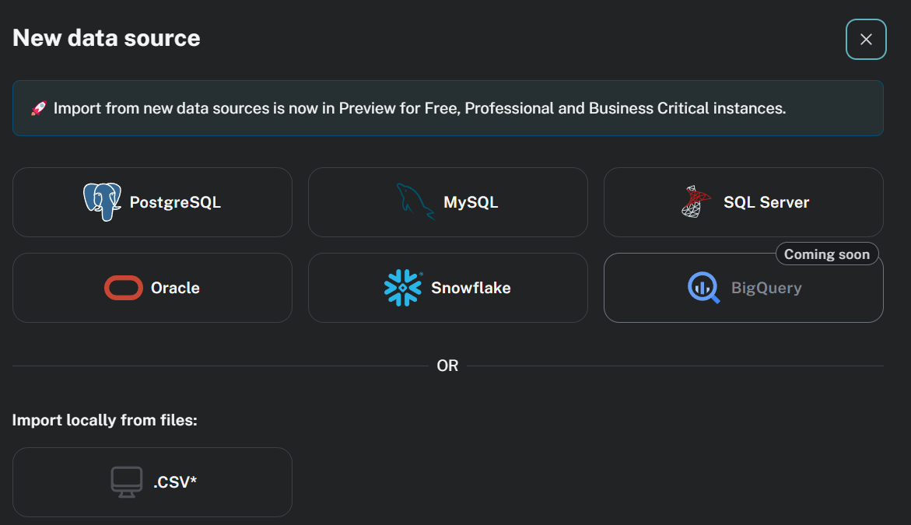

# Transitioning from SQL to Knowledge Graphs: Two approaches

Most companies today rely heavily on relational databases (SQL) to store and manage structured data. However, as applications evolve — especially with the rise of AI, semantic search, and GraphRAG — the limitations of traditional SQL become more apparent when dealing with highly connected or context-rich data.

There are two widely used technologies that enable a transition toward knowledge graphs:

---

## 1. Stardog – Graph layer over existing SQL

Stardog is a knowledge graph platform that allows organizations to connect their existing SQL databases without migration. Using a feature called Virtual Graphs, Stardog can interpret relational data as graph data on the fly.

- No data duplication — SQL remains the source of truth

- Mapping files define how tables/columns are turned into graph structures

- Supports SPARQL queries, reasoning, ontologies, and integration of multiple data sources

- Ideal for gradual adoption: you can start small and expand over time

Note: A previous student project explored this path using Stardog. For more detailed explanations, please have a look at this project.

---

## 2. Neo4j – Native property graph model 

Neo4j is a popular graph database that uses a different approach: it stores data natively as a property graph.

- Requires data to be imported or restructured (no direct virtual graph equivalent)

- Queries are written using Cypher, Neo4j's graph query language

- Often involves exporting SQL data and transforming it into graph format

Neo4j is a powerful option when you want to fully embrace the graph model, but typically requires more upfront restructuring and does not directly integrate SQL in the same seamless way as Stardog.

You can import you data from different data sources like the following:

---