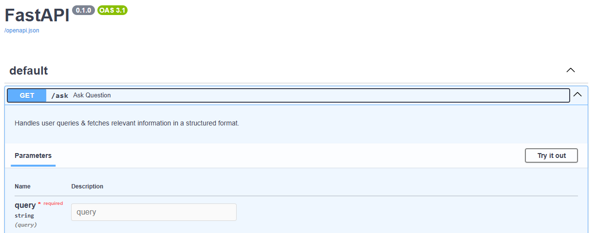

# FastAPI - Lightweight API for GraphRAG backend

## What is FastAPI?

[FastAPI](https://fastapi.tiangolo.com/) is a modern, high-performance Python web framework for building APIs. It’s built on top of **Starlette** and **Pydantic**, making it fast, simple, and easy to use — perfect for rapid prototyping and production-level apps alike.

In this project, FastAPI powers the backend API that connects the **Frontend UI**, **FAISS retrieval**, and **Neo4j graph database**.

---

## Installation

Install FastAPI and a server (we use `uvicorn` for development) (already in the requirements.txt file):

```bash
pip install fastapi uvicorn
```

## How It’s Used in This Project
We use FastAPI to define a simple route that accepts a movie-related question and returns a structured response. The endpoint connects all retrieval components (FAISS + Neo4j) and returns data to the frontend.

```
app = FastAPI()

@app.get("/ask")
def ask_question(query: str):
    """Handles user queries & fetches relevant information in a structured format."""
    response = retrieve_context(query)
    return {"movies": response}
```

When you call this /ask endpoint with a query like "What are some Horror Movies?"", it returns a JSON response with relevant movie information pulled from both vector and graph-based retrieval.

---

## Running the API
To run the API locally: ```bash uvicorn api.main:app --reload ```
Then go to http://localhost:8000/docs for interactive Swagger documentation.



---

## Why We Used FastAPI

- **Fast & efficient**: Built on ASGI for high-performance APIs.

- **Pythonic**: Clean and readable syntax.

- **Async support**: Easily handle input/output operations like database calls.

- **Automatic docs**: OpenAPI/Swagger docs available at `/docs`.

- **Easy integration**: Works well with Neo4j, FAISS, and local LLMs like Ollama.

---

## Advantages of FastAPI

- **High Performance**: FastAPI is built on top of ASGI (Asynchronous Server Gateway Interface), making it one of the fastest Python frameworks available today.

- **Automatic Documentation**: Built-in support for OpenAPI and Swagger UI — no extra setup needed.

- **Easy to Use**: Clean, and modern syntax. Easy for beginners and still efficient for advanced users.

- **Asynchronous Support**: Fully supports `async` and `await`, great for operations like databases or external APIs.

- **Modular and Scalable**: Easy to build small services and grow them into larger, modular applications.

---

## Disadvantages of FastAPI

- **Fewer Extensions**: Compared to Django or Flask, FastAPI has a smaller ecosystem of plugins and built-in tools.

- **Authentication and Authorization**: Not as robust out-of-the-box; you often need to build your own auth logic or use third-party packages.

---

## Alternatives to FastAPI

| Framework        | Language     | Strengths                                             | Weaknesses                              |
|------------------|--------------|-------------------------------------------------------|------------------------------------------|
| **Flask**         | Python       | Minimalistic, flexible, large community               | No async by default, fewer modern features |
| **Django REST**   | Python       | Feature-rich, good for full-stack apps                | Heavyweight, less async-friendly         |
| **Express.js**    | JavaScript   | Fast setup, huge ecosystem, NodeJS-based              | Requires JavaScript, not Python          |
| **Spring Boot**   | Java         | Great for enterprise apps, very robust                | Requires Java, steeper learning curve    |

---

## 📝 Summary

FastAPI is a lightweight yet powerful framework perfect for building modern APIs — especially useful in machine learning, data apps, or AI assistants like **GraphRAG**. It provides fast performance, clean syntax, and automatic docs out of the box. While it’s not as full-featured as Django or others its simplicity and performance make it a top choice for our project.

---

## References for this readme file:
- https://fastapi.tiangolo.com/
- https://fastapi.tiangolo.com/tutorial/
- https://devdocs.io/fastapi/
- https://medium.com/@shariq.ahmed525/fastapi-advantages-and-disadvantages-fe1e5190317d
- https://dev.to/fuadrafid/fastapi-the-good-the-bad-and-the-ugly-20ob
- https://flask.palletsprojects.com/en/stable/
- https://www.djangoproject.com/
- https://expressjs.com/
- https://spring.io/projects/spring-boot 
