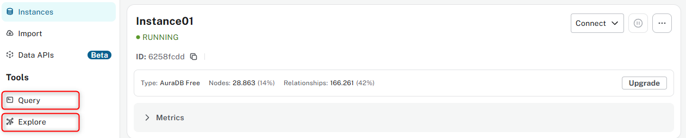

# Neo4j - Graph database for movie knowledge

## Overview

Neo4j is a graph database used in this project to store structured movie data including:

- **Movies**

- **Actors**

- **Directors**

- **Genres**

- **Users**

- **Ratings**

By using graph relationships (e.g., `(:User)-[:RATED]->(:Movie)-[:ACTED_IN]<-(:Actor)`), Neo4j enable relationship-based reasoning, allowing insights to emerge through entity connections.

---

## Installation & Setup

### Option 1: Use the cloud version 

1. Access the site: [https://neo4j.com/](https://neo4j.com/)

2. Click on **Get Started Free** and create an account

3. Create a new instance if you do not have one yet by clicking on **Create instance**

4. You can now **import** your data from a **data source** or directly click on the three dots next to the current instance, select **Backup & restore** and browse for your **.dump file**. If you are interest in using the same database about movies, find the .dump file in the folder **db_backup_file**

### Option 2: Neo4j Desktop

1. Download Neo4j Desktop: [https://neo4j.com/download/](https://neo4j.com/download/)

2. Install and open the application

3. Create a **Local Database** 

Access Neo4j at: [http://localhost:7474](http://localhost:7474)

## Option 3: Use Neo4j in Docker
1. Install Docker Desktop
2. run the following command: 
```bash
docker run \
  --name neo4j-local \
  --restart always \
  -p 7474:7474 -p 7687:7687 \
  -e NEO4J_AUTH=neo4j/your_password \
  -v $HOME/neo4j/data:/data \
  neo4j:5.17
  ```
3. Access Neo4j at: [http://localhost:7474](http://localhost:7474)

---

### Usage of Neo4j 

In the Neo4j interface, you'll find two key tools: **Query** and **Explore**.


**Query** allows you to write and execute Cypher queries manually. It's the primary way to interact with the graph using Neo4j's query language, giving you full control to retrieve nodes, relationships, paths, and more. You can filter, sort, or even return visual subgraphs — great for debugging or exploring specific questions. Below an exmaple of a query:

---

```
MATCH (m:Movie)<-[r:RATED]-()
WITH m, AVG(toFloat(r.rating)) AS avg_rating
OPTIONAL MATCH (m)<-[:DIRECTED]-(d:Director)
RETURN m.title AS Movie, d.name AS Director, round(avg_rating, 2) AS AvgRating
ORDER BY avg_rating DESC
LIMIT 5
```

**Explore** provides a more visual, no-code experience. It lets you click through nodes and relationships in the graph interactively. This is helpful for quickly understanding the structure of your database, discovering hidden connections, and exploring without needing to know Cypher.

---

### Connection to the database
To connect your application to the Neo4j database, you use the official **neo4j Python driver**. In the project, connection credentials like the database URI, username, and password are stored securely in a .env file. The app establishes a session with the database using these credentials, allowing it to run Cypher queries and retrieve graph data dynamically. This connection powers the core of the GraphRAG system by enabling traversal of movie relationships, such as ACTED_IN, DIRECTED, or RATED. Here's a quick example of how the connection is initialized in code:

```
driver = GraphDatabase.driver(NEO4J_URI, auth=(NEO4J_USER, NEO4J_PASSWORD))
```

---

### How it is further used in this project

We use Neo4j to fetch rich knowledge graphs from movie relationships. Here's a sample Python function using the Neo4j Python driver:

```
MATCH (m:Movie)
    WHERE m.movieId IN $movie_ids

    OPTIONAL MATCH (m)<-[:ACTED_IN]-(a:Actor)
    OPTIONAL MATCH (m)<-[:DIRECTED]-(d:Director)
    OPTIONAL MATCH (m)-[:IN_GENRE]->(g:Genre)
    OPTIONAL MATCH (u:User)-[r:RATED]->(m)

    RETURN 
        m.movieId AS id,
        COALESCE(m.title, "Unknown") AS title,
        COALESCE(m.year, "Unknown") AS year,
        COALESCE(m.plot, "No plot available") AS plot,
        COALESCE(m.languages, "Unknown") AS languages,
        COALESCE(m.countries, "Unknown") AS countries,
        COLLECT(DISTINCT COALESCE(a.name, "")) AS actors,
        COLLECT(DISTINCT COALESCE(d.name, "")) AS directors,
        COLLECT(DISTINCT COALESCE(g.name, "")) AS genres,
        COLLECT(DISTINCT {id: u.userId, name: u.name}) AS user_ratings,
        AVG(toFloat(r.rating)) AS avg_rating
    """

    with driver.session() as session:
        result = session.run(query, movie_ids=movie_ids)
        return [
            {
                "id": record["id"],
                "title": record["title"],
                "year": record["year"],
                "plot": record["plot"],
                "languages": record["languages"],
                "countries": record["countries"],
                "actors": record["actors"],
                "directors": record["directors"],
                "genres": record["genres"],
                "user_ratings": record["user_ratings"],
                "avg_rating": record["avg_rating"] if record["avg_rating"] else 0.0 
            }
            for record in result
        ]
```

---

## Why we decided to use Neo4j

Neo4j is a native graph database used to store data as nodes and relationships, rather than traditional rows and tables. In our project, this makes it perfect for modeling complex and interconnected movie data, such as:

- Movies connected to actors, genres, and directors

- Users rating multiple movies

- Efficient querying of connected data (e.g., retrieving all movies from a specific director)

- Seamless integration of diverse data types (e.g., ratings, genres, actors) for better insights

Thanks to its structure and query language, Neo4j allows us to easily traverse these relationships to answer natural-language questions.

---

### Advantages of Neo4j

- Graph database: Data is stored as nodes and relationships

- Free to use: Neo4j has a Community Edition that is free and perfect for local development and learning.

- Strong documentation & adoption: Neo4j is used by companies like ebay, Adobe, UBS and others. It has therefore a lot of documentation available.

- Cypher query language: Simple and powerful for writing expressive graph queries.

- Visualization: Neo4j’s browser lets you explore the graph interactively using Query and Explore modes.

- Strong Python support: Neo4j provides official drivers that integrate well with FastAPI for example.

---

## Disadvantages of Neo4j

- Write scalability: While read queries are fast, write-heavy workloads or large-scale ingestion (e.g. real-time logging) require tuning and often the Enterprise version.

-  Memory-hungry: Neo4j can use a lot of RAM, especially with large datasets or when many relationships are involved.

- Learning curve
Cypher is easy, but thinking in graphs is different from traditional SQL. 

- Limited local clustering: The free Community Edition doesn’t support horizontal scaling or clustering (only available in Enterprise).

---

## Alternatives to Neo4j

| Database             | Type                          | Strengths                                                                 |
|----------------------|-------------------------------|---------------------------------------------------------------------------|
| **ArangoDB**         | Graph + Document (Multi-model) | Flexible schema, supports both document and graph queries                |
| **JanusGraph**       | Distributed Graph              | Scales horizontally, good for huge graphs, integrates with big data tools |
| **Amazon Neptune**   | Managed Graph DB on AWS        | Fully managed, supports Gremlin and SPARQL, great for AWS-based stacks   |
| **OrientDB**         | Graph + Document Hybrid        | Combines document and graph, easy for developers used to NoSQL           |
| **RedisGraph**       | In-memory Graph Engine         | Extremely fast, ideal for real-time use cases, uses Cypher syntax        |
| **TigerGraph**       | Native Parallel Graph DB       | High performance on very large graphs, great for analytics               |

---

## Summary

We chose Neo4j because it is a **free**, **beginner-friendly**, and highly **visual graph database** that fits  with our movie dataset. Its graph-native structure and rich query language is perfect for ou GraphRAG application and allow deep insights.

---

## References for this readme file:

- https://neo4j.com/docs/desktop-manual/current/installation/ 
- https://neo4j.com/who-uses-neo4j/ 
- https://neo4j.com/docs/python-manual/current/connect/ 
- https://www.quora.com/What-are-the-weaknesses-of-Neo4j
- https://alronz.github.io/Factors-Influencing-NoSQL-Adoption/site/Neo4j/Results/Strengths%20and%20Weaknesses/
- https://neo4j.com/top-ten-reasons/
- https://arangodb.com/ 
- https://janusgraph.org/
- https://pages.awscloud.com/AWS-Learning-Path-Getting-Started-with-Amazon-Neptune_2020_LP_0009-DAT.html
- https://orientdb.org/
- https://redis.io/docs/latest/operate/oss_and_stack/stack-with-enterprise/deprecated-features/graph/
- https://www.tigergraph.com/